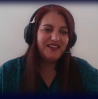

---
authors:
- admin
#- 吳恩達
categories:
#- Demo
#- 教程
date: "2021-11-18T00:00:00Z"
draft: false
featured: false
image:
#  caption: 'Image credit: [**Unsplash**](https://unsplash.com/photos/CpkOjOcXdUY)'
  focal_point: ""
  placement: 2
  preview_only: false
lastmod: "2021-11-18T00:00:00Z"
projects: []
subtitle: "The inclusion guide"
#summary: "Welcome \U0001F44B We know that first impressions are important, so we've
#  populated your new site with some initial content to help you get familiar with
#  everything in no time."
tags:
#- Academic
#- 开源
title: For a better understanding of what Artificial Intelligence is and how it can be used (or misused) in education and training

---

## Chrysanthi Katrini

We have been carrying  regular communication and exchanges with  teachers and non-formal educators within the scope of [**FAIAS project**](https://fosteringai.github.io/).
Either through focus groups or informal sessions, the aim is to create a closer relationship between the project and the educational community.
In this context, we talked to  Chrysanthi Katrini and he kindly answered  some questions about and the work of his organization does in teaching artificial intelligence. 
 
Chrysanthi Katrini was born in Greece and studied computer engineering and two master's degrees related to computer science and engineering. She currently lives in Leuven, Belgium where she works for the organization [BeCode](https://becode.org/) as an artificial intelligence (AI) mentor. This organization aims to teach IT-related topics (such as programming or AI) to all people who for various reasons haven´t accessed to this type of education. 
 
BeCode offers a full 7-month course in which concepts related to programming and AI are taught in a progressive manner. The first month teaches the most basic concepts of the Python language, how to program, what is a function, OOP... Then, the second and third months consist on data science knowledge, such as learning how to use Python libraries for data processing. In that sense, the mentors of the course try to teach the importance of being aware of the presence of bias in the data, since it can totally condition the predictions of the models that are implemented.

The fourth and fifth month focus on teaching AI and machine learning (ML) from a market needs point of view and not just as an ideal use case. This course is taught in English, which allows students to learn this language. In that sense, they also teach students languages such as German or French to be able to access the local Belgian market.

Currently they welcome 45 students to learn about AI, that is to say, this course offers a preparation for the professional world to 45 future technicians. This market is increasingly demanding ML engineers and data scientists. 
Specifically, some of the tools they use are as follows: 
- [Teachable machine](https://teachablemachine.withgoogle.com/): allows the creation of ML models in an online, simple and visual way.
- Transfer learning: allows to know the performance of AI models already trained by simply making predictions on the inputs provided. This allows understanding how these models work.

### [📬 Subscribe to our newsletter](http://eepurl.com/hLgTQz) Sing up to receive more information about FAIaS project via email, and you’ll be the first to know about Artificial Intelligence and more.
