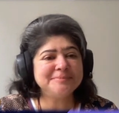

---
authors:
- admin
#- 吳恩達
categories:
#- Demo
#- 教程
date: "2021-11-18T00:00:00Z"
draft: false
featured: false
image:
#  caption: 'Image credit: [**Unsplash**](https://unsplash.com/photos/CpkOjOcXdUY)'
  focal_point: ""
  placement: 2
  preview_only: false
lastmod: "2021-11-18T00:00:00Z"
projects: []
subtitle: "The inclusion guide"
#summary: "Welcome \U0001F44B We know that first impressions are important, so we've
#  populated your new site with some initial content to help you get familiar with
#  everything in no time."
tags:
#- Academic
#- 开源
title: For a better understanding of what Artificial Intelligence is and how it can be used (or misused) in education and training

---

## Madhumalti Sharma

We have been carrying  regular communication and exchanges with  teachers and non-formal educators within the scope of [**FAIAS project**](https://fosteringai.github.io/).
Either through focus groups or informal sessions, the aim is to create a closer relationship between the project and the educational community.
In this context, we talked to  Chrysanthi Katrini and he kindly answered  some questions about and her job in teaching artificial intelligence. 
 
Madhumalti Sharma was born in India and she is currently working in Luxembourg. She has more than 25 years of experience in the field of Information Technology, including 11 years with IBM and she is also the founder and president of the non-profit organization [Workshop4Me](https://workshop4me.org/). This organization teaches children to create, instead of being consumers, using technology.

She is the EU National Robotics Coordinator and an ambassador for EU Code Week. In the EU Robotics Week she has created some programs in Scratch in which they created filters similar to those of the Snapchat application. For this, they used facial recognition, which allowed them to add the various elements to the image and have them move with the person.
She also mentor in the New York academy's STEM fellows program and children (especially girls) in a variety of technology-related skills competitions.

Technology in general and artificial intelligence (AI) in particular are enabling multiple advances and improvements in society that various groups may perceive as a threat to their respective jobs. However, this fear does not exist in the field of teachers; it is considered as a challenge to which they must learn how it works and take advantage of the benefits it provides.

To face this challenge, there are some integrated applications that allow school students to improve in a personalized way the areas of knowledge they need. Similarly, it is important that teachers also understand the need and benefits that AI provides in the classroom. Its implementation in schools has already begun, as is the case in the USA.

It is important that school teachers in various areas are aware of the need to work in the classroom with tools that incorporate AI. It is not only necessary to apply it to complex subjects such as those related to mathematics or technology, but it can also be interesting in subjects such as music.

On the other hand, it is important to be aware of the presence of bias in a group of developers. It is possible that, without being aware of it, they introduce bias on the developed products. To remedy this, an ethically diverse group could be included.

It is important to note the low presence of women in the world of programming and development. Despite living in an advanced society, the figure of the programmer or scientist is still associated with a white male. Madhumalti has worked with IBM to recruit and promote the participation of women in this field. In order to address this situation, it would be interesting to carry out actions with which women feel comfortable and supported from an early age in the areas of science, such as mathematics or technology.

Education is no longer the rigid structure it was a few years ago. The situation has changed and it is important that teachers also learn from their students. Furthermore, education should not only take place in the classroom, it should also start with teaching from the students' families. This change also includes the use of AI to improve the learning process in schools.

### [📬 Subscribe to our newsletter](http://eepurl.com/hLgTQz) Sing up to receive more information about FAIaS project via email, and you’ll be the first to know about Artificial Intelligence and more.
