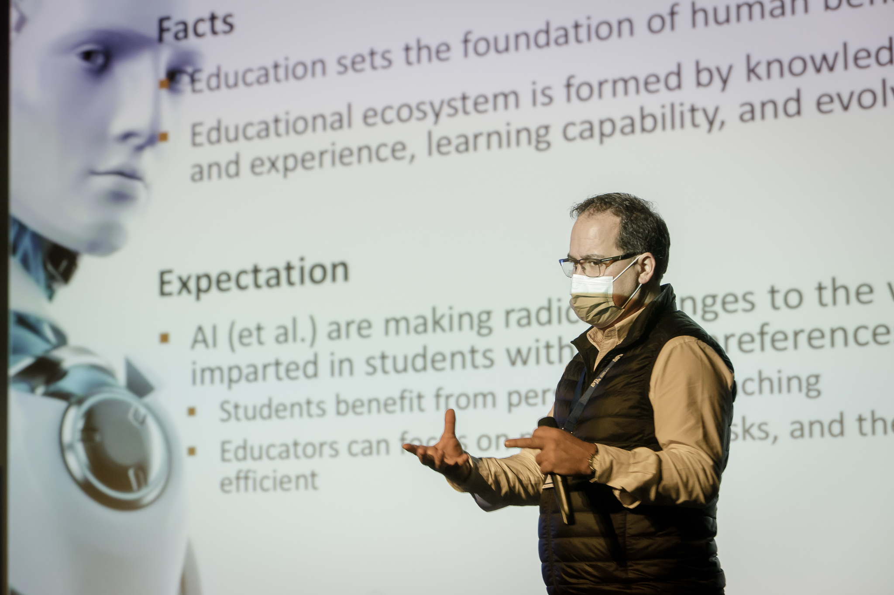

---
authors:
- admin
#- 吳恩達
categories:
#- Demo
#- 教程
date: "2021-12-09T00:00:00Z"
draft: false
featured: false
image:
#  caption: 'Image credit: [**Unsplash**](https://unsplash.com/photos/CpkOjOcXdUY)'
  focal_point: ""
  placement: 2
  preview_only: false
lastmod: "2021-12-09T00:00:00Z"
projects: []
subtitle: "The Impact Gathering on AI in education-Braga City 2021"
#summary: "Welcome \U0001F44B We know that first impressions are important, so we've
#  populated your new site with some initial content to help you get familiar with
#  everything in no time."
tags:
#- Academic
#- 开源
title: All about the 1st Multiplier Event
---

On the 26th of November, FAIAS partners organized the 1st Multiplier Event under the great coordination of partner [**Teatro Circo de Braga**](https://fosteringai.github.io/partners/teatro/).  This Impact Gathering attracted a diverse public ranging from teachers to policy makers, with the slogan: “For a better understanding of what Artificial Intelligence is and how it can be used (or misused) in education and training”. 

This event had two parts: in the morning there were engaging talks at the main conference room, and in the afternoon [**practical workshops**](https://fosteringai.github.io/post/ai_at_schools/).

The first part in the morning started with a Keynote from [**Paulo Novais**](https://www.di.uminho.pt/~pjn/) with the title of "Artificial Intelligence and Educational Challenges: Fundamental Concepts, Present and Future Applications”. Paulo Novais explained how humans had always worried about transmitting knowledge to the future generations. And he showed how technological evolution can help us to solve that problem and other social and economical problems. He explained how AI has been integrated in our life and how it has progressed till the point of creating artwork today. 

Paulo's speech showed examples of the use of emerging technologies at schools: robots in the classroom, use of sensors and cameras to monitor some behaviors, virtual reality… and he inspired the public to take advantage of the use of AI tools and smart classroom resources to enhance the learning for each student.

After Paulo Novais, the next speaker [**Gregorio Robles**](https://gestion2.urjc.es/pdi/ver/gregorio.robles) explained the main objectives of the Erasmus+ project FAIaS (Fostering Artificial Intelligence at schools) and its ultimate goal: inspire teachers to learn about AI, make it accessible to them and facilitate the work of teaching AI in any subject, not only in the most technical or mathematical subjects. This translates into 3 concrete [**project results**](https://fosteringai.github.io/#projects) with guidelines, lesson plans and an easy to use machine learning tool integrated into the lessons.

The next talks in the morning were in the form of a panel, a debate about "An Artificial Intelligence centered on trust”.  For this occasion, the speakers were [**Maria Manuel Leitão Marques**](https://www.europarl.europa.eu/meps/en/197635/MARIA-MANUEL_LEITAO-MARQUES/home) (Member of the European Parliament and Member of the Special Committee on Artificial Intelligence in the Digital Age AIDA), [**Vitor Carvalho**](https://2ai.ipca.pt/vitor-carvalho/) (Professor and Researcher at IPCA & Member of the Commission's Expert Group on Artificial Intelligence and Data in Education and Training at the European Commission), [**Liliana Carrillo**](https://tedxantwerp.be/speakers/liliana-carrillo-2/) (Founding Director of CollectiveUP, co-founder of the European Digital Development Alliance and co-founder of Shine Your Light) and [**Joana Miranda**](https://www.linkedin.com/in/jomoreda/) (Executive Director of Braga, Unesco Creative City in Media Arts).

The panelists talked about some of their worries and wishes about the use of AI:
- The use of data in AI-based tools, citizens’ rights, data privacy and the use of data.  
- The challenges about bias in AI.
- The importance of having good datasets for creating good AI models.
- And the use of AI for the benefit and support of the community.

It was of particular interest to hear about the human-centered and society-centered approach to AI at technology that all the panelists had.  The FAIAS partners are pleased with the support from EU Parliamentarian Maria Manuel Leitão Marques and her support on Twitter 

Just after the panel, the morning program was closed by [**Ricardo Rio**](https://www.cm-braga.pt/en/0101/municipio/camara-municipal/presidente), Braga’s Mayor, who also counted with the virtual attendance of EU Parliamentarian Maria.A networking lunch followed his closing words.

In the afternoon, the second part of the event started with four workshops related to AI topics. The first workshop was carried out by [**Marjon Blondeel**](https://www.linkedin.com/in/mb-3678a5b3/) and had as title "In a Reinforcement Learning agent's shoes" . This workshop was very popular among teachers from Braga city schools, and many attended it and learned about the [**Reinforcement Learning**](https://en.wikipedia.org/wiki/Reinforcement_learning) technique and some of the mysteries behind it.

The second workshop was "Discovering our unconscious [**bias**](https://en.wikipedia.org/wiki/Bias)" carried out by [**Liliana Carrillo**](https://www.linkedin.com/in/carrilloliliana/) and many teachers learned about the biases that each person has about different topics. Teachers were invited to participate in several activities that helped them realize their unconscious biases and invited them to become more conscious about it.

The third workshop was “LearningML tool” given by [**Luisa Yánez**](https://www.linkedin.com/in/luisa-y%C3%A1nez-guti%C3%A9rrez-ia-bigdata/). In this workshop, she showed to teachers how easy it is to create text and image classification models in the [**LearningML**](https://web.learningml.org/) tool and its use to activate students' critical thinking. This LearningML tool is an [**open-source web application**](https://gitlab.com/users/learningml/projects)  created to facilitate the learning and teaching of [**Machine Learning**](https://en.wikipedia.org/wiki/Machine_learning).

The fourth workshop was the “Moral Machine” given by Antonio [**José Romero**](https://www.linkedin.com/in/antonio-jose-romero-barrera/). [**The Moral Machine**](https://www.moralmachine.net/) is a web tool created by [**MIT**](https://www.mit.edu/) to pose dilemmas about decision-making of autonomous devices in extreme situations. In this workshop, the importance of pondering about certain circumstances and implementing critical thinking based lessons was emphasized.

Acknowledgements:
[**FAIAS partners**](https://fosteringai.github.io/#partners) thank everyone who cooperated in any way to the successful organization of this event. 
A special thanks to partner [**Teatro Circo de Braga**](https://fosteringai.github.io/partners/teatro/) for the great leadership and hospitality shown before, during and after this event. Thanks!

### [📬 Subscribe to our newsletter](http://eepurl.com/hLgTQz) Sing up to receive more information about FAIaS project via email, and you’ll be the first to know about Artificial Intelligence and more.

