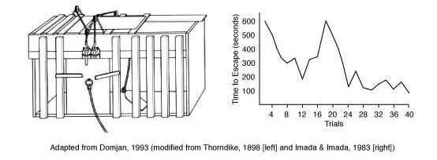
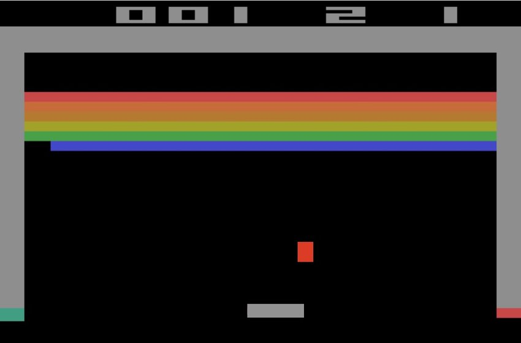
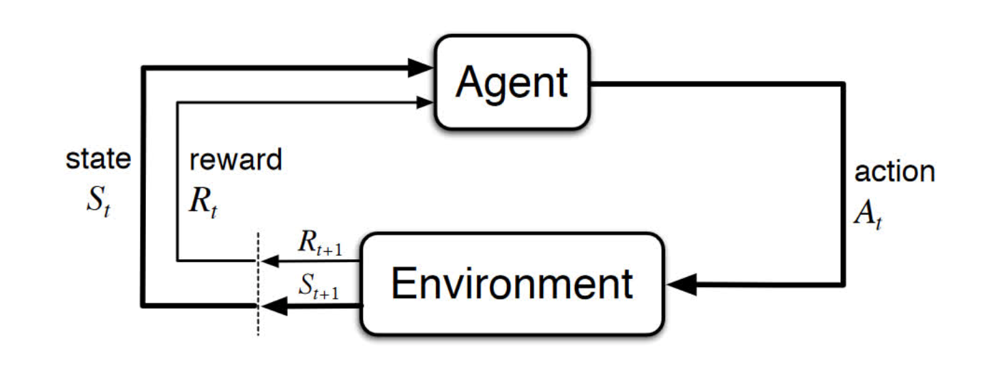
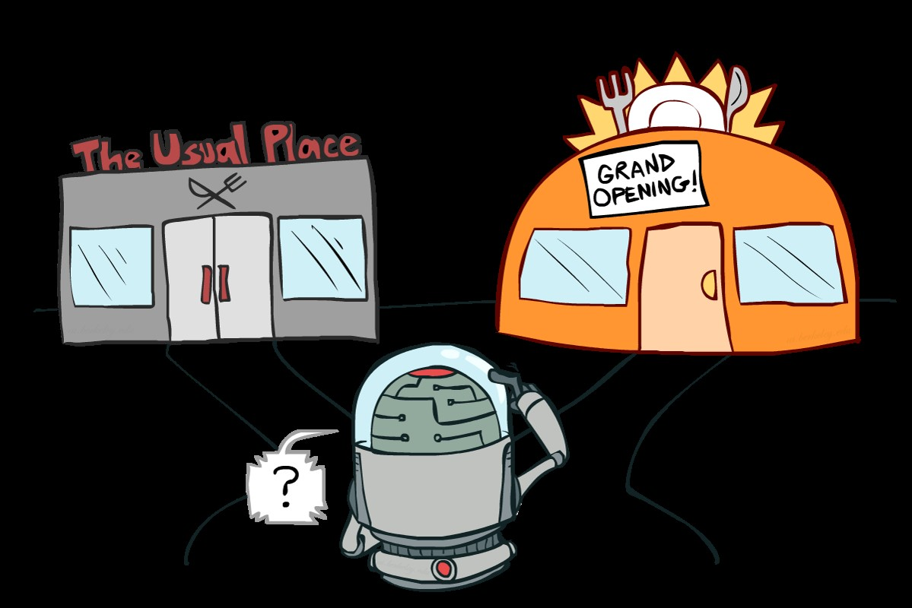
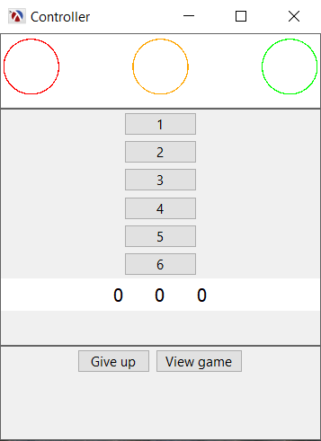
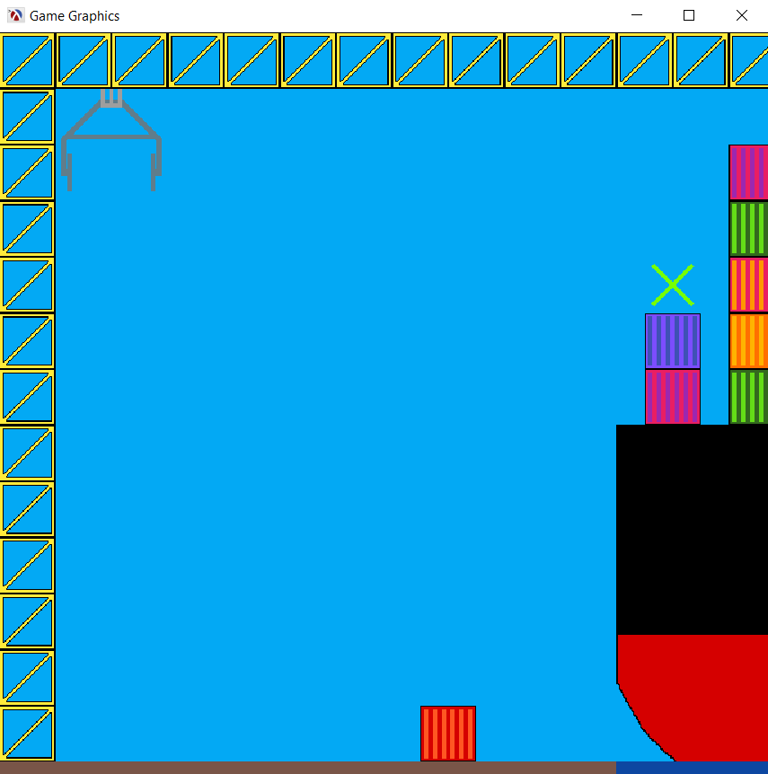
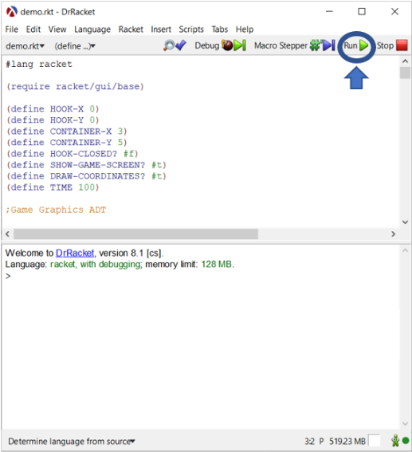

---
authors:
- admin
#- 吳恩達
categories:
#- Demo
#- 教程
date: "2022-01-12T00:00:00Z"
draft: false
featured: false
image:
#  caption: 'Image credit: [**Unsplash**](https://unsplash.com/photos/CpkOjOcXdUY)'
  focal_point: ""
  placement: 2
  preview_only: false
lastmod: "2022-01-12T00:00:00Z"
projects: []
subtitle: "FAIaS Result 1"
#summary: "Welcome \U0001F44B We know that first impressions are important, so we've
#  populated your new site with some initial content to help you get familiar with
#  everything in no time."
tags:
#- Academic
#- 开源
title: 'In a Reinforcement Learning agent’s shoes'
---

Artificial Intelligence (AI) is all around us and we use it everyday: spam filters, online chatbots, search engines, video games anticipating our next moves, navigation apps, rideshare apps, just to name a few. The underlying processes and concepts however are rarely exposed to most people, making it difficult to understand what AI is and how it should be approached. Understanding the fundamental concepts however is becoming very important for people of all ages, including children who are growing up in an environment that integrates more AI products than ever before.
In the workshop In a Reinforcement Learning agent’s shoes held during the first [**Multiplier Event in Braga**](https://fosteringai.github.io/post/ai_at_schools/) on the 26th of November, 2021, we explored the concepts and ideas behind  Reinforcement Learning and we even put ourselves in the shoes of an agent learning a task through Reinforcement Learning. You can download the slides (in Spanish) here **{}Download{}**

Reinforcement Learning is currently one of the most popular subfields of Artificial Intelligence. It is the main technology behind autonomous vehicles and it is used for numerous tasks such as real-time bidding and automated temperature control in data centres. In several video games, the best AI controlled players use Reinforcement Learning. The most famous examples are AlphaGo and its latest evolution [**AlphaGo Zero**](https://deepmind.com/blog/article/alphago-zero-starting-scratch). AlphaGo was the first computer program to defeat a world champion in Go, one of the most complex games that exist. It was able to win after training on thousands of games played by humans. AlphaGo Zero even goes one step further; it does not know the rules and just starts learning how to play the game by playing against itself, becoming its own teacher.

Many of the core algorithms in Reinforcement Learning were originally inspired by biological learning systems such as operant conditioning, a behaviourist technique in psychology, where behaviour is reinforced by positive or negative stimuli. Operant conditioning was extensively studied by Edward L. Thorndike (1874-1949) who observed the behaviour of hungry cats trying to escape puzzle boxes. Cats could escape the box and reach the food by means of simple actions such as pulling a cord. At first it took the cats a long time to get out of the box, but on successive trials it became easier to a point where the cats would be able to escape without hesitation. 

Thorndike called this The Law of Effect which states that any behaviour that is followed by pleasant consequences is likely to be repeated, and behaviour followed by unpleasant consequences is likely to be stopped. To understand their physical environment, the cats interact with it using trial and error until a successful result is obtained. 

Humans are really good at learning by trial and error. A typical example is how humans learn how to ride a bike: you cannot learn it from a book, you cannot learn it by watching others, the only way is by doing it. At first you will make mistakes and probably fall off (negative reward) but eventually, after several failed attempts, you will figure out how to do it. This is exactly the idea behind Reinforcement Learning, a goal-based learning technique in which an agent learns by trial and error which actions it should take in different situations or states in order to optimize a reward. A second example is parents who treat their children to chocolate when they finish their homework. Here we already see a potential pitfall: the child learns that he will receive a treat or a reward when he finishes his homework, but he will not learn how to do it without mistakes. Indeed, when programming a Reinforcement Learning algorithm setting a correct reward is very important.

To illustrate how Reinforcement Learning works, let us look at the Atari game Breakout which you can play [**here**](https://elgoog.im/breakout/) and where you must eliminate as many bricks as possible using a single ball. You can use the walls and/or the paddle below to hit the ball against the bricks and destroy them, but you lose a turn when the paddle misses the ball’s rebound. 

An agent can learn how to play the game by interacting with the environment and trying to find out which action it should take in a situation or state to obtain the highest reward at the end of the game. Possible actions are moving the paddle to some extent to the left or to the right. Taking such an action changes the environment: bricks might have been destroyed, the paddle and the ball are in another position. The agent also receives an immediate reward depending on how many bricks he destroyed. Based on the new state, the agent then takes another action. This loop is repeated during many games until the agent learns which action he should take in every state in order to maximize the total reward which in this case is the score at the end of a game. 

One of the challenges here is the **trade-off between exploration and exploitation**. To obtain a high reward, the agent should take actions that it has tried in the past and found to be effective. However, in order to discover these actions, it has to try actions that it has not selected before. In other words, the agent should exploit what it already knows, but it should also explore in order to choose better actions in the future. Determining the perfect equilibrium between both is not only a research topic in Reinforcement Learning, it is also one of the biggest problems humans face when learning a new skill: should you repeat what you have done until now or should you try something else that might get you better results.

In this [**video**]( https://www.youtube.com/watch?v=TmPfTpjtdgg) you can check how a Reinforcement Learning algorithm learns how to play Breakout and how it evolves over training. In the beginning it makes quite some mistakes, even after 100 trials. But if it keeps playing for a couple of hours, it gets to human level and after a couple more hours it becomes even better and learns a trick called tunnelling: it goes around the sides and lets the ball bounce around on top. It has learned a strategy the programmer of the algorithm had not anticipated.

<iframe width="560" height="315" src="https://www.youtube.com/embed/TmPfTpjtdgg" title="YouTube video player" frameborder="0" allow="accelerometer; autoplay; clipboard-write; encrypted-media; gyroscope; picture-in-picture" allowfullscreen></iframe>

For his Bachelor thesis How an AI agent sees the world (2021), Alessandro Fasano - under the supervision of professor [**Ann Nowé**](https://ai.vub.ac.be/team/ann-nowe/) and advisors [**Hélène Plisnier**](https://ai.vub.ac.be/team/helene-plisnier/) and [**Denis Steckelmacher**](https://ai.vub.ac.be/team/denis-steckelmacher/) from the VUB’s AI Lab - implemented a game that puts the player literally in the shoes of an agent learning a task using Reinforcement Learning. The goal of this project was to teach people the principles of trial and error and rewards while having fun. By showing how the technology works, he wanted to make people more comfortable with AI and temper anxiety towards it.

The game does not only explain the concepts, but it also illustrates the differences between humans and algorithms. For instance, in the next screenshot you can see what the player sees: he controls the actions which are numbered 1 to 6 and at each timestep he can observe the state which consists of three numbers. After taking an action, i.e. picking a number between 1 and 6, he receives a reward in the form of a colour, where green indicates a positive reward, red a negative reward and orange something in between. This is everything the player sees. He does not have any clue of what he is controlling. From the player’s point of view, there is no meaning attached to the actions or the state, they are just numbers. 

On a hidden screen other people can follow what is happening in reality: the player is controlling a crane and has to put a container on a ship. The player, just like a real AI algorithm, has no clue whether he is trying to learn how to play chess, Breakout or operating a crane. This reflects the fact that algorithms manipulate numbers, whereas humans are flexible in their thinking, can reason about concepts and can contextualize.

The game is written in the Scheme programming language. You can download the demo directly, the file is called `demo.rkt` 
<a target="_blank" download="demo.rkt" href="demo.rkt">Download it</a>

If you want to run the game you should download [**Racket**](https://racket-lang.org/). You can run the game using DrRacket which will be installed automatically together with Racket. Save demo.rkt on your computer and open it in DrRacket by clicking File -> Open. You will then see the following screen.

After clicking on run the screen with the control panel and the screen containing the graphics will open. You can then start playing by choosing actions. After winning or losing the game, you will find a text file in the same folder as where you saved demo.rkt. This text file contains an overview of the actions you have chosen during the game. You can delete this file if you want.

As an alternative to using DrRacket you can also navigate to the file’s directory using the command line and start the demo by typing

 racket demo.rkt 

### [📬 Subscribe to our newsletter](http://eepurl.com/hLgTQz) Sing up to receive more information about FAIaS project via email, and you’ll be the first to know about Artificial Intelligence and more.

