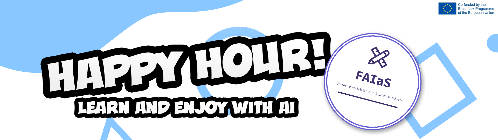

---
authors:
- admin
#- 吳恩達
categories:
#- Demo
#- 教程
date: "2021-11-18T00:00:00Z"
draft: false
featured: false
image:
#  caption: 'Image credit: [**Unsplash**](https://unsplash.com/photos/CpkOjOcXdUY)'
  focal_point: ""
  placement: 2
  preview_only: false
lastmod: "2021-11-18T00:00:00Z"
projects: []
subtitle: "The inclusion guide"
#summary: "Welcome \U0001F44B We know that first impressions are important, so we've
#  populated your new site with some initial content to help you get familiar with
#  everything in no time."
tags:
#- Academic
#- 开源

---

## HAPPY HOUR #2 SUMMARY

A few weeks ago, the second edition of our quarterly, free and open live program called Happy Hour took place, in which in one hour we tell you curiosities and news about Artificial Intelligence. If you want to watch it beacause you lost it or you want to watch the streaming again, we’ve uploaded the streaming to our YouTube channel and now it’s available to watch!  
 
[**Gregorio Robles**](https://www.linkedin.com/in/gregoriorobles), director of FAIaS project and URJC professor, presented and manages the live show, as in our first edition, and had [**Juan David**](https://twitter.com/juandalibaba) (developer of the LearningML educational tool) and [**Chema González**](https://twitter.com/chemagzm) as fellow speakers. The collaborators gave their point of view about some topics that appears throughout the streaming and share their experience with LearningML tool from the side of a teacher and a developer. If you want to share your experience with AI and Machine Learning in the next Happy Hour program , don’t hesitate to [**contact us!**](https://fosteringai.github.io/#contact)
 
In the streaming we could watch four short videos about BIAS, LearningML and FAIaS future events, recorded by [**Liliana Carrillo**](https://www.linkedin.com/in/carrilloliliana/), [**Antonio J. Romero**](https://www.linkedin.com/in/antonio-jose-romero-barrera/) y [**Jorge Lobo**](https://twitter.com/lobo_tic). We let you the following links to the YouTube videos: 

- [**BIAS BY LILIANA CARRILLO**](https://youtu.be/_aL0pXS3g2s)
- [**LML DATASETS TUTORIAL**](https://youtu.be/pCBEwT--o1Q)
- [**LML TEXT TUTORIAL**](https://www.youtube.com/watch?v=Jyfm02nYR8Y&t=0s)
- [**FAIAS EVENTS**](https://youtu.be/ixKfgFHZcUI)
 
If you want to know all the news about FAIaS project and watch the following edition of the Happy Hour, we encourage to you to follow us in our social networks and to share with us your opinion about this streaming format to improve them in the following sessions. Thanks, and we hope to see you there!follow us on our social networks and subscribe to our newsletter:

- [**Twitter**](https://twitter.com/fosteringai)
- [**Newsletter**](http://eepurl.com/hLgTQz)

We hope to see you and enjoy your company!

### [📬 Subscribe to our newsletter](http://eepurl.com/hLgTQz) Sing up to receive more information about FAIaS project via email, and you’ll be the first to know about Artificial Intelligence and more.

