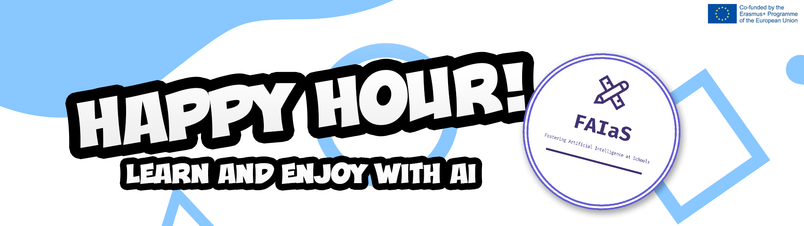

## HAPPY HOUR #4!

This 14th of September, will take take place the fourth edition of our streaming program 'Happy Hour'. With the begining of the new school year, we bring you new experiences, experts and video sections in this edition. This streaming is a great oportunity to get new ideas to implant in the coming academic course and learn about new methodologies to use these technologies in your classes.

What is Happy Hour? The Happy Hour is a live event where you will have the opportunity to interact in a dynamic and fun way with the different speakers and guests. Various topics on Artificial Intelligence and Machine Learning are covered in short sections of about 5 minutes each.

You can watch our 3 previous editions of Happy Hour [**here!**](https://www.youtube.com/watch?v=dNqTIVoByWM&list=PLaJK9Y94GVlO-glIX_KieSgQy51bJh0wQ)
To be able to participate you only need to register in our [**Eventbrite event**](https://www.eventbrite.es/e/faias-happy-hour-4-spanish-tickets-415861913177), and one day before the Happy Hour, you will receive an email with the password to access the streaming on the BigBlueButton platform. [**Register here!**](https://www.eventbrite.es/e/faias-happy-hour-4-spanish-tickets-415861913177)

We only have to invite you to follow us on our social networks and subscribe to our newsletter:

-[**Twitter](https://twitter.com/fosteringai)
-[**Newsletter**](http://eepurl.com/hLgTQz)

We hope to see you and enjoy your company!

### [📬 Subscribe to our newsletter](http://eepurl.com/hLgTQz) Sing up to receive more information about FAIaS project via email, and you’ll be the first to know about Artificial Intelligence and more.

