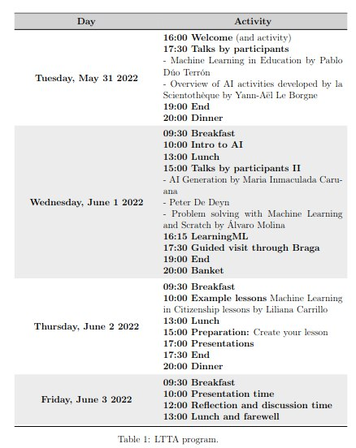

## LTTA Program

During this week our LTTA event will take place, bringing together educators from different parts of Portugal, Spain and Belgium. During the 4 days of the event, the attendees will carry out a series of training and recreational activities in the Portuguese city of Braga. The programme of the event is shown in the following image, which shows the dates and times of the event activities,

You can download the pdf version [**here!**](https://fosteringai.github.io/post/ltta_program/LTTA_program.pdf)

## FAIaS Partner Organizations

- [**Universidad Rey Juan Carlos**](https://fosteringai.github.io/partners/urjc/), Spain (experts in CT and authors of the Dr. Scratch tool)
- [**Vrije Universiteit Brussel**](https://fosteringai.github.io/partners/vub/), Belgium (experts in Artificial Intelligence research, education and lifelong learning)
- [**CollectiveUP**](https://fosteringai.github.io/partners/collectiveup/), Belgium (experts in non-formal learning environments, esp. minorities and girls)
- [**Braga Media Arts**](https://fosteringai.github.io/partners/teatro/), Portugal (offers network of schools and teachers)

## Important Information

LTTA event date: May 31-June 3 2022
- Activities resources:
	- [**Result 1 page**](https://fosteringai.github.io/project/result1/)
	- [**Result 2 page**](https://fosteringai.github.io/project/result2/)
	- [**Result 3 page**](https://fosteringai.github.io/project/result3/)
- Breakfast, lunch and dinner places
	- Breakfast: Doce Carmo R. do Carmo
	- Lunches: Mostarda e Chocolate Praça Conde de Agrolongo
	- Dinners (Tuesday and Thursday): Atravessado R. de Santo António das Travessas 30
	- Banquet (Wednesday): Bem-me-quer Campo das Hortas, 6

## Contact

- Web: fosteringai.net
- Email: FAIaS@fosteringai.net
- Twitter: https://twitter.com/fosteringai

